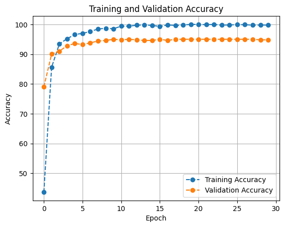
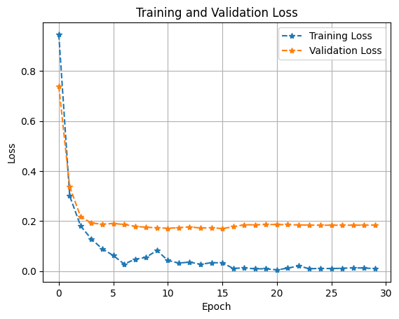
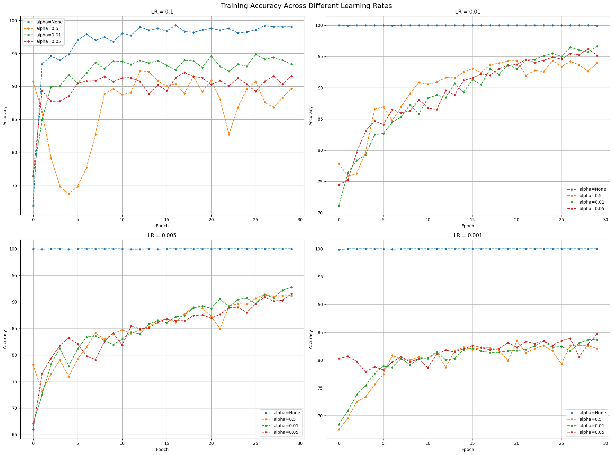
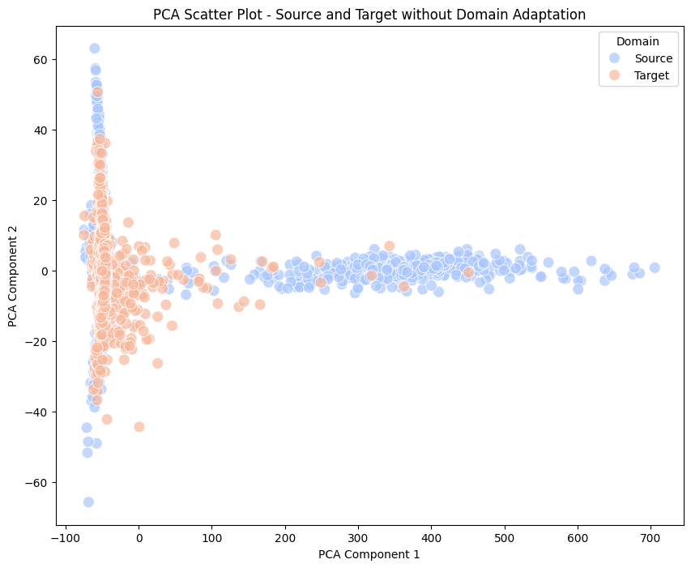
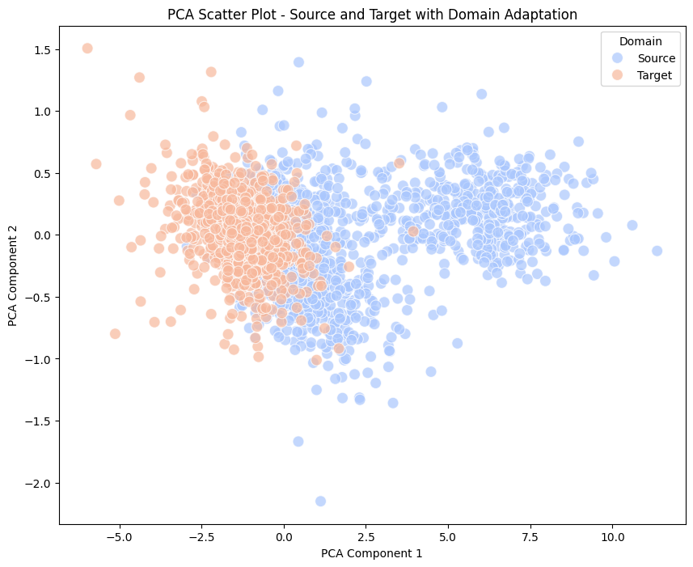

# Unsupervised Domain Adaptation on PACS dataset

When using deep neural networks, we frequently consider as if the training dataset and testing dataset due abide by the same feature representations. However, in reality, this hypothesis is far from correct as the training dataset and testing dataset could have diverse feature representations. This phenomenon might lead to a significant drop in the performance of the model. This is where domain adaptation comes into play. Domain adaptation is a technique that helps in transferring the knowledge from the source domain to the target domain. Thus making the deep neural network model more robust to catch more generic features while training and thus being more accurate in testing.

## Author

- [@peteralhachem](https://github.com/peteralhachem)

## Badges

## Repository structure

The repository is structured as follows:

- `DANN_utils/`: contains the dataset used in the project and the script for the domain adaptation neural network that was used as a model .

- `img/`: contains the images used in the README file.

- `DANN.ipynb`: Python notebook with all the script that was executed to get all the results.

- `DANN.pdf`: The instruction followed in order to perform the project.

- `README.md`: contains the description of the project, the dataset used, the model used, the results, and the conclusion.

- `results_da.txt`: contains the results of the model when training on the photo domain for the classifier and testing on the art painting for domain adaptation layer, it contains the results of all the hyperparameters optimization that was conducted.

## Dataset

The dataset used in this project is the PACS dataset. The PACS dataset is a dataset that contains images from four different domains: Photo, Art, Cartoon, and Sketch. The dataset contains 7,000 images in total, with 1,700 images per domain. The dataset is used to evaluate the performance of the model in unsupervised domain adaptation.

_Figure 1: Example of the PACS dataset_

A pliminary analysis of the photo domain (the dataset that will be used mainly as a source domain) with respect to the other domains present of the dataset shows that the dataset is not balanced.

The dataset contains 1670 images in the photo domain, 2048 images in the art domain, 2344 images in the cartoon domain, and 3929 images in the sketch domain.

It is important to take into account this unbalanced distribution of the dataset when training the model as we may encounter some issues when training the model.

_Figure 2: Domain comparisons_

On the other hand, when comparing the different 7 classes present in each domain, the sparsity of the classes should also be taken into consideration when training the classifier of the model as, if needed, the rigidity of the classifier could be affected by the different distribution of the classes in the different domains.

_Figure 3: Class comparisons_

## Model

In this section, we will introduce the models that will be used in order to train and test the model in different domains. We will split the description of the model into two parts: the classifier and the domain adaptation.

When we talk about the classifier, we will perform training and testing on a photo domain using a pretrained AlexNet model, while testing it on a art painting domain using the same model. Its purpose is to classify each image as one of the 7 categories of images present in all domains. The model will be trained on the photo domain and tested on the art painting domain. The model will be trained using the cross-entropy loss function.

On the other hander, in the domain adaptation section, we will use the same model, AlexNet, but we will add a domain adaptation layer to the model. The domain adaptation layer will be used to adapt the model to the target domain. Its only purpose is to classify the images in either source or target domain, hence a trivial binary classification task. The model will be trained using the adversarial loss function.

_Figure 4: Domain adaptation network_

## Results

In this section, we will present the results of the model when training and testing on the photo domain and testing on the art painting domain without domain adaptation.

We will also present the results of the model when training and testing on the photo domain, art domain using domain adaptation while performing cross-validation on the cartoon and sketch domains.

The results will be presented in the form of loss and accuracy scores.

### 1. Training without domain adaptation

Using a pre-trained AlexNet model, we train the photo domain using cross-validation and test on the art painting domain. The training was conducted using the following hyperparameters:

- Learning rate: 0.001
- Weight decay: 0.0005
- Batch size for training dataset: 256
- Batch size for testing dataset: 64
- Number of epochs: 30
- Momentum: 0.9
- Optimizer: SGD

The results of the training are as follows:

_Figure 5: Accuracy metric on the training without domain adaptation_

_Figure 6: Loss metric on the training without domain adaptation_

As we can see from the figures above, the model has performed quite well in understanding and learning from the features of the photo domain being our training dataset, as we were able to achieve a maximum accuracy of 100% and a minimum loss of 0.0001 within 30 epochs.

However, when testing the model on the art painting domain, the model has performed poorly as we were only able to achieve a maximum accuracy of 52.59% and a minimum loss of 2.152 within 30 epochs. This is due to the fact that the model was not able to generalize the features of the photo domain to the art painting domain.

### 2. Training with domain adaptation

In this section, we will evaluate the performance of the model when training on the photo domain and art domain using domain adaptation. The training was conducted using grid search hyperparameter optimization with the following hyperparameters:

- _learning rate:_ 0.1, 0.01, 0.001, 0.005
- _alpha:_ None, 0.5, 0.1, 0.05

where _alpha_ is the weight of the reversed backpropagation that is applied to the domain adaptation layer.

In order to train the model with domain adaptation, we needed to split the training phase into two separate sections:

1. Training the classifier on the photo domain.
2. Training the domain adaptation layer on both the photo domain and the art domain.

It is important to highlight that the source domain (photo domain) was given the label 0 when classifying the domains, while the target domain (art domain) was given the label 1.

The results of the training are displayed by the two important metrics: **_accuracy_** and **_loss_** and they are as follows:

_Figure 7: Accuracy metric on the training with domain adaptation_

_Figure 8: Loss metric on the training with domain adaptation_

As we can see from the figures above, the model was able to perform decently with respect to the model without domain adaptation. It is evident that the model with a learning rate of 0.01 was the most performant out of all the models as it was able to achieve a very close performance accuracy with respect to all the alpha parameters considered while reducing the loss of the model to nearly 0.0001.

Few are the models that do not behave similarly to their counterparts as every single model considered was able to outpeform the model without domain adaptation.

### 3. Testing with domain adaptation

In order to test the model with domain adaptation, we decided to consider the most performant model for each combination of the hyperparameter search grid. We then decide to perform the cross validation taking into consideration a two transfer of domains:

1. From the photo domain to the sketch domain.
2. From the photo domain to the cartoon domain.

The testing phase was split into two separate sections:

1. Training the model for 5 epochs on the sketch domain and the cartoon domain.

2. Test the classifier on both the sketch domain and the cartoon domain.

3. Evaluate the performance of the domain adaptation model using the accuracy for each domain seperately and then the average accuracy.

The results are the following:

| Learning Rate (LR) | Alpha    | Cartoon Accuracy (%) | Sketch Accuracy (%) | Average Accuracy (%) |
| ------------------ | -------- | -------------------- | ------------------- | -------------------- |
| 0.1                | None     | 23.04                | 22.60               | 22.82                |
| 0.1                | 0.5      | 49.38                | 63.93               | 56.66                |
| 0.1                | 0.01     | 52.99                | 61.49               | 57.24                |
| 0.1                | 0.05     | 45.65                | 59.86               | 52.76                |
| **0.01**           | **None** | **36.26**            | **28.76**           | **32.51**            |
| **0.01**           | **0.5**  | **58.77**            | **64.95**           | **61.86**            |
| 0.01               | 0.01     | 54.74                | 62.33               | 58.53                |
| 0.01               | 0.05     | 55.74                | 63.96               | 59.85                |
| 0.005              | None     | 34.77                | 26.39               | 30.58                |
| **0.005**          | **0.5**  | **59.58**            | **62.34**           | **60.96**            |
| 0.005              | 0.01     | 54.24                | 62.24               | 58.24                |
| 0.005              | 0.05     | 53.84                | 62.52               | 58.18                |
| 0.001              | None     | 35.20                | 25.96               | 30.58                |
| 0.001              | 0.5      | 54.97                | 63.07               | 59.02                |
| 0.001              | 0.01     | 54.44                | 62.15               | 58.30                |
| 0.001              | 0.05     | 54.20                | 62.19               | 58.20                |

## Feature Representation

In order to visualize better the performance of the model we decide to use the PCA algorithm to represent features in a 2D space. The PCA algorithm is a dimensionality reduction algorithm that is used to reduce the number of features in a dataset while preserving the variance of the dataset. The PCA algorithm is used to visualize the features of the model both the source and target domain in a 2D space.

We will represent both the source and target domain in a 2D space using the PCA algorithm. The results are as follows:

_Figure 9: PCA plot of the source and target domain without domain adaptation_

As we can see from the figure above, the source domain and the target domain are not well represented in the 2D space. This is due to the fact that the model was not able to generalize the features of the source domain to the target domain. As a result, the feature distribution of the target domain is isolated from the feature distribution of the source domain. This does explain the poor performance of the model when testing on the target domain that was interpreted with a low accuracy of the classifier.

_Figure 10: PCA plot of the source and target domain with domain adaptation_

On the other hand, when using domain adaptation, the source domain and the target domain are well integration in the 2D space. This is due to the fact that the model was able to generalize the features of the source domain to the target domain. As a result, the feature distribution of the target domain is well distributed with the features of the source domain. We do highlight that the model could be refined to have a better sparsity of the features of the source and target domain.

## Conclusion

In this project, we have presented the results of the model when training and testing on the photo domain and testing on the art painting domain without domain adaptation. We have also presented the results of the model when training and testing on the photo domain, art domain using domain adaptation while performing cross-validation on the cartoon and sketch domains.

The results show that the model with domain adaptation was able to outperform the model without domain adaptation. The model with domain adaptation was able to achieve a maximum accuracy of 61.86% and a minimum loss of 0.0001 within 30 epochs. This is due to the fact that the model was able to generalize the features of the source domain to the target domain using the domain adaptation layer.

We have also presented a visualization of the results of the model when training and testing on the photo domain and testing on the art painting domain without domain adaptation in 2D space using the PCA algorithm. The results show that the source domain and the target domain are not well represented in the 2D space. This is due to the fact that the model was not able to generalize the features of the source domain to the target domain. As a result, the feature distribution of the target domain is isolated from the feature distribution of the source domain.

On the other hand, when using domain adaptation, the source domain and the target domain are well integrated in the 2D space. This is due to the fact that the model was able to generalize the features of the source domain to the target domain. As a result, the feature distribution of the target domain is well distributed with the features of the source domain.

## References

1. Long, M., Cao, Y., Wang, J., & Jordan, M. I. (2015). Learning transferable features with deep adaptation networks. In International conference on machine learning (pp. 97-105).

2. Ganin, Y., Ustinova, E., Ajakan, H., Germain, P., Larochelle, H., Laviolette, F., ... & Lempitsky, V. (2016). Domain-adversarial training of neural networks. The Journal of Machine Learning Research, 17(1), 2096-2030.

3. Ganin, Y., & Lempitsky, V. (2015). Unsupervised domain adaptation by backpropagation. arXiv preprint arXiv:1409.7495.

4. Ganin, Y., Ustinova, E., Ajakan, H., Germain, P., Larochelle, H., Laviolette, F., ... & Lempitsky, V. (2016). Domain-adversarial training of neural networks. The Journal of Machine Learning Research, 17(1), 2096-2030.
