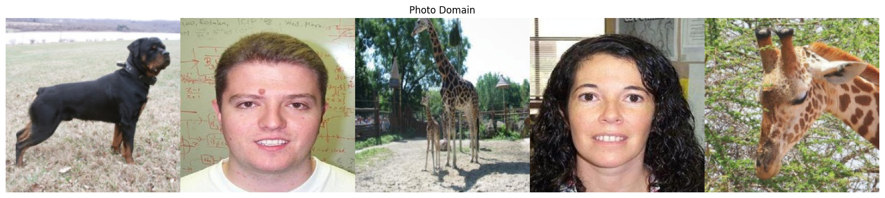
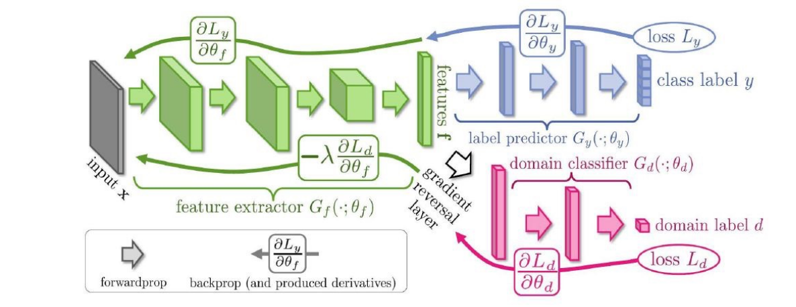
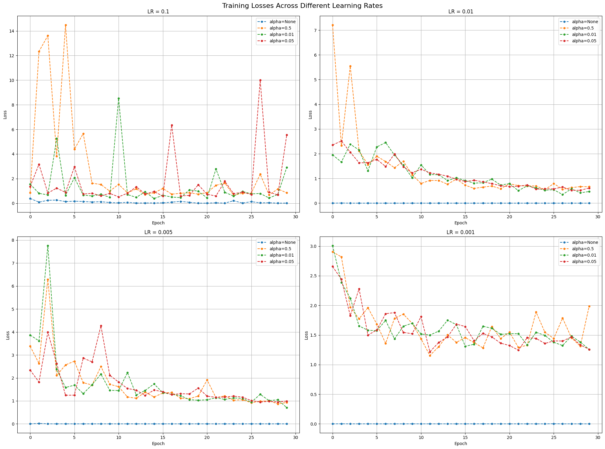

# Unsupervised Domain Adaptation on PACS dataset

When using deep neural networks, we frequently consider as if the training dataset and testing dataset due abide by the same feature representations. However, in reality, this hypothesis is far from correct as the training dataset and testing dataset could have diverse feature representations. This phenomenon might lead to a significant drop in the performance of the model. This is where domain adaptation comes into play. Domain adaptation is a technique that helps in transferring the knowledge from the source domain to the target domain. Thus making the deep neural network model more robust to catch more generic features while training and thus being more accurate in testing.

## Author

- [@peteralhachem](https://github.com/peteralhachem)

## Badges

## Dataset

The dataset used in this project is the PACS dataset. The PACS dataset is a dataset that contains images from four different domains: Photo, Art, Cartoon, and Sketch. The dataset contains 7,000 images in total, with 1,700 images per domain. The dataset is used to evaluate the performance of the model in unsupervised domain adaptation.

_Figure 1: Example of the PACS dataset_

A pliminary analysis of the photo domain (the dataset that will be used mainly as a source domain) with respect to the other domains present of the dataset shows that the dataset is not balanced.

The dataset contains 1670 images in the photo domain, 2048 images in the art domain, 2344 images in the cartoon domain, and 3929 images in the sketch domain.

It is important to take into account this unbalanced distribution of the dataset when training the model as we may encounter some issues when training the model.

_Figure 2: Domain comparisons_

On the other hand, when comparing the different 7 classes present in each domain, the sparsity of the classes should also be taken into consideration when training the classifier of the model as, if needed, the rigidity of the classifier could be affected by the different distribution of the classes in the different domains.

_Figure 3: Class comparisons_

## Model

In this section, we will introduce the models that will be used in order to train and test the model in different domains. We will split the description of the model into two parts: the classifier and the domain adaptation.

When we talk about the classifier, we will perform training and testing on a photo domain using a pretrained AlexNet model, while testing it on a art painting domain using the same model. Its purpose is to classify each image as one of the 7 categories of images present in all domains. The model will be trained on the photo domain and tested on the art painting domain. The model will be trained using the cross-entropy loss function.

On the other hander, in the domain adaptation section, we will use the same model, AlexNet, but we will add a domain adaptation layer to the model. The domain adaptation layer will be used to adapt the model to the target domain. Its only purpose is to classify the images in either source or target domain, hence a trivial binary classification task. The model will be trained using the adversarial loss function.

_Figure 4: Domain adaptation network_

## Results

In this section, we will present the results of the model when training and testing on the photo domain and testing on the art painting domain without domain adaptation.

We will also present the results of the model when training and testing on the photo domain, art domain using domain adaptation while performing cross-validation on the cartoon and sketch domains.

The results will be presented in the form of loss and accuracy scores.

### 1. Training without domain adaptation

Using a pre-trained AlexNet model, we train the photo domain using cross-validation and test on the art painting domain. The training was conducted using the following hyperparameters:

- Learning rate: 0.001
- Weight decay: 0.0005
- Batch size for training dataset: 256
- Batch size for testing dataset: 64
- Number of epochs: 30
- Momentum: 0.9
- Optimizer: SGD

The results of the training are as follows:

_Figure 5: Accuracy metric on the training without domain adaptation_

_Figure 6: Loss metric on the training without domain adaptation_

As we can see from the figures above, the model has performed quite well in understanding and learning from the features of the photo domain being our training dataset, as we were able to achieve a maximum accuracy of 100% and a minimum loss of 0.0001 within 30 epochs.

However, when testing the model on the art painting domain, the model has performed poorly as we were only able to achieve a maximum accuracy of 52.59% and a minimum loss of 2.152 within 30 epochs. This is due to the fact that the model was not able to generalize the features of the photo domain to the art painting domain.

### 2. Training with domain adaptation
